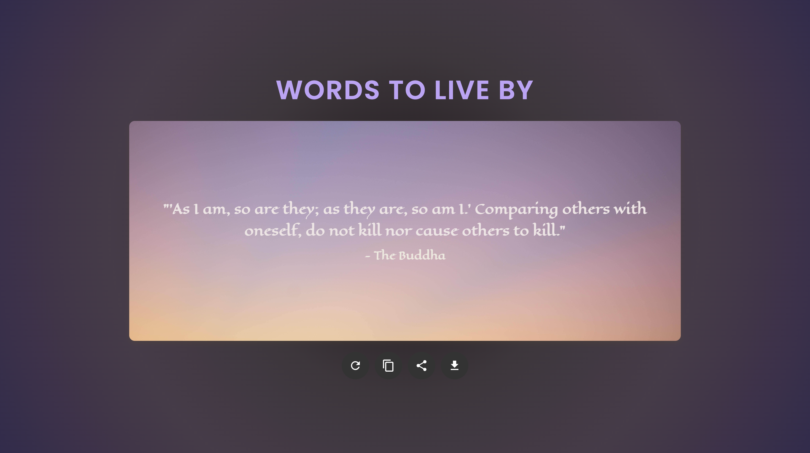

# Quote of the Day

Display a random quote fetched from an [API](https://api.freeapi.app/api/v1/public/quotes/quote/random).

## Features
- Fetch a random quote from the API.
- Display the quote and author on the page.
- Set a random background image behind the quote.
- New quote is generated through **Refresh** Icon.
- Implement a **copy-to-clipboard** button.
- Add a share on **Twitter button**.
- Add an **Export button** to save the quote as an image to the user’s device

## Technologies Used
- HTML
- CSS
- JavaScript
- html2canvas: for exporting quotes as images

## Screenshot

## Deployment Link
[Random Quote Generator](https://random-quote-generator-sandy-tau.vercel.app/)

